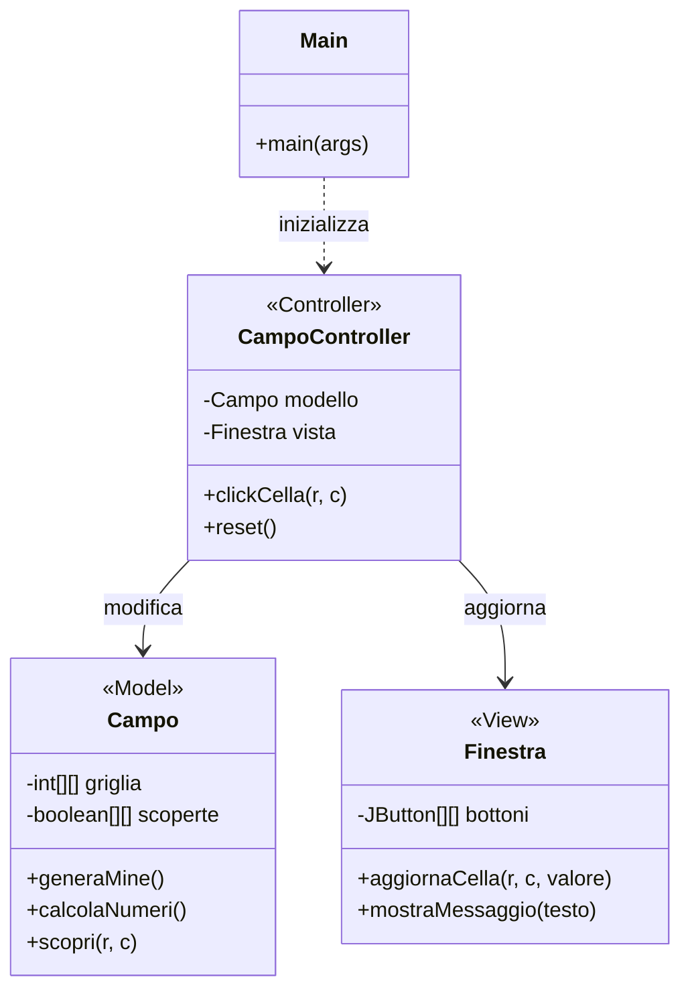
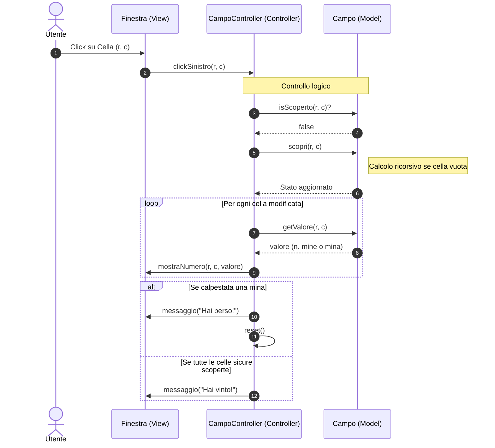

# 🌼 Prato Fiorito MVC – Java Swing


Implementazione didattica del classico gioco **Prato Fiorito** (Minesweeper) sviluppata in Java utilizzando il pattern architetturale **Model-View-Controller (MVC)**.

Questo progetto è concepito come *Project Work* per studenti di Informatica, finalizzato all'apprendimento delle basi della programmazione ad oggetti e della gestione di interfacce grafiche complesse.

## 🎯 Obiettivi Didattici
Il progetto permette di approfondire i seguenti concetti:
*   **Progettazione Software:** Organizzazione del codice secondo criteri di modularità.
*   **Architettura MVC:** Separazione netta tra logica di business, interfaccia utente e gestione degli eventi.
*   **Gestione GUI:** Utilizzo della libreria Java Swing, gestione dei layout e dei componenti.
*   **Algoritmi su Matrici:** Manipolazione di griglie bidimensionali per il calcolo delle mine e dei numeri di prossimità.
*   **Ricorsione:** Implementazione dell'algoritmo di "flood fill" per l'apertura automatica delle celle vuote.

## 🎮 Funzionalità
- ✅ **Campo di gioco dinamico:** Generazione casuale delle mine a ogni nuova partita.
- ✅ **Interazione Mouse:** 
    - *Click sinistro:* Scopre una cella.
    - *Click destro:* Inserisce/rimuove una bandiera.
- ✅ **Algoritmo Ricorsivo:** Apertura automatica a catena quando si clicca su una cella senza mine adiacenti.
- ✅ **Sistema di Feedback:**
    - Timer della partita in tempo reale.
    - Contatore delle mine rimanenti.
    - Messaggi di vittoria o sconfitta.
- ✅ **Menu Difficoltà:** Possibilità di cambiare la dimensione della griglia (Facile, Medio, Difficile).
- ✅ **Reset rapido:** Pulsante dedicato per ricominciare la partita.

## 🏗️ Architettura del Progetto
Il software è diviso in tre componenti principali come previsto dal pattern MVC:

1.  **Modello (`Campo`):** Contiene i dati puri. Gestisce la matrice delle mine, il calcolo dei numeri di adiacenza e lo stato logico di ogni cella (coperta, scoperta, bandiera). Non conosce l'interfaccia grafica.
2.  **Vista (`Finestra`):** Gestisce l'aspetto visivo. Crea la finestra (JFrame), i pulsanti (JButton) e i vari componenti Swing. Si occupa esclusivamente di mostrare i dati a video.
3.  **Controller (`CampoController`):** Il "cervello" dell'applicazione. Riceve gli input dall'utente tramite la `Finestra`, aggiorna lo stato del `Campo` e comanda alla `Finestra` cosa mostrare.

### Diagramma delle Classi (UML)


## 🔄 Flusso di Esecuzione (Diagramma delle Sequenze)

Il seguente diagramma illustra cosa accade quando un utente clicca su una cella del campo di gioco. Mostra chiaramente come il **Controller** faccia da ponte tra la **Vista** e il **Modello**.



### Descrizione del Flusso:
1.  **Input:** L'utente interagisce con la `Finestra` (View) cliccando su un pulsante della griglia.
2.  **Notifica:** La View non decide cosa fare, ma delega l'azione al `CampoController`.
3.  **Logica:** Il Controller interroga il `Campo` (Model) per verificare lo stato della cella e ordina di "scoprirla".
4.  **Ricorsione:** Se la cella è vuota (0 mine adiacenti), il Modello esegue l'algoritmo di espansione.
5.  **Aggiornamento:** Il Controller legge i nuovi dati dal Modello e comanda alla View di aggiornare l'interfaccia grafica (cambiare colore ai tasti, mostrare i numeri o l'icona della mina).
6.  **Fine Partita:** Il Controller verifica le condizioni di vittoria o sconfitta e mostra un messaggio all'utente tramite la View.

---

   ```
3. **Compila il progetto:**
   ```bash
   javac *.java
   ```
4. **Avvia l'applicazione:**
   ```bash
   java Main
   ```

## 🛠️ Tecnologie Utilizzate
- **Linguaggio:** Java
- **Interfaccia Grafica:** Java Swing / AWT
- **Strumenti:** Mermaid.js per la documentazione UML

---
*Progetto sviluppato a scopo didattico.* 🌼
